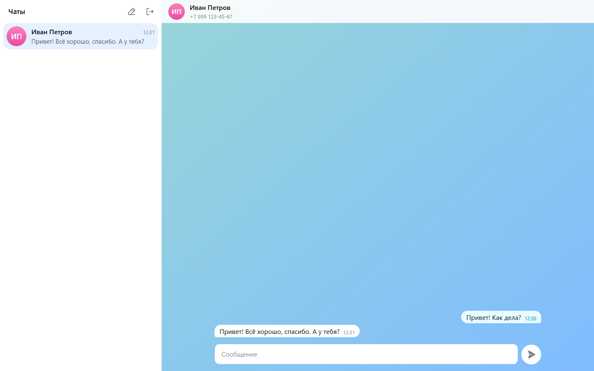
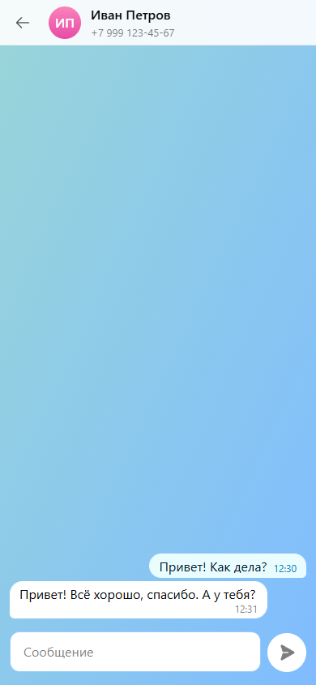

# Чат для MAX через GREEN-API

Небольшой клиент мессенджера MAX на React. Он входит в инстанс GREEN-API по idInstance и apiTokenInstance, создаёт чат по номеру телефона, отправляет текстовые сообщения и принимает ответы.

Демо: https://maketostep.github.io/GREEN-WEBCHAT/





## Стек

Vite 8, React 19, TypeScript в строгом режиме, Tailwind CSS 4, Vitest, oxlint, иконки из @phosphor-icons/react. Для сборки нужен Node 20.19+ или 22.12+.

## Запуск

```bash
npm install
npm run dev
```

Остальные команды:

- `npm test` запускает тесты Vitest.
- `npm run build` проверяет типы и собирает проект в `dist`.
- `npm run preview` отдаёт собранный `dist` локально.
- `npm run lint` запускает oxlint.

Чтобы не вводить ключи при каждом запуске, скопируйте `.env.example` в `.env` и заполните `idInstance` и `apiTokenInstance`. Форма входа подставит эти значения, но только на `npm run dev`. Production-сборка их не содержит. Скрипт `dev` запускает `vite --host`, поэтому dev-сервер виден в локальной сети и отдаёт подставленные значения. С настоящими ключами в `.env` запускайте его только в доверенной сети.

## Что нужно для входа

1. Создайте инстанс MAX в личном кабинете https://console.green-api.com и авторизуйте его.
2. Скопируйте оттуда `idInstance` и `apiTokenInstance`.
3. Поле `apiUrl` можно оставить пустым. Приложение строит адрес из первых четырёх цифр idInstance, например `https://3100.api.green-api.com`.

У новых инстансов все уведомления выключены. После входа приложение читает настройки через GetSettings. Если входящие уведомления выключены, оно показывает сообщение с кнопкой «Включить». Кнопка вызывает SetSettings с `incomingWebhook=yes`. Инстанс перезапускается, настройка применяется в течение 5 минут.

HTTP API ничего не получает, пока в настройках инстанса задан `webhookUrl`. Если приложение видит заполненный `webhookUrl`, оно сообщает об этом, и вы очищаете поле в консоли GREEN-API.

## Как это устроено

- Новый чат создаётся по номеру. Принимаются номера России (+7) и Беларуси (+375): это ограничение метода CheckAccount. Метод возвращает числовой chatId MAX.
- Входящие уведомления содержат chatId, номера телефона в них нет. Ответ попадает в тот же чат, который вы создали.
- После входа список чатов берётся из GetChats (только личные чаты). История чата подгружается через GetChatHistory при открытии: последние 100 сообщений, API хранит до трёх месяцев.
- Отправка идёт через SendMessage. Приложение отправляет только текст, до 4000 символов.
- Приём работает через long polling HTTP API: ReceiveNotification с `receiveTimeout=20`, затем DeleteNotification для каждого уведомления. Текстовые сообщения попадают в чат, остальные уведомления удаляются без показа.
- Очередь уведомлений читает одна вкладка браузера, остальные получают сообщения через localStorage. Проверка настроек сама повторяется до трёх раз, если GREEN-API отвечает 429.
- При сетевой ошибке приложение показывает баннер и повторяет запрос каждые 5 секунд.
- История чатов и данные входа лежат в localStorage браузера. Кнопка «Выйти» удаляет их.

## Ограничения

Бесплатный тариф MAX Developer даёт 3 чата и 100 вызовов CheckAccount в месяц.

Не реализовано намеренно: медиафайлы, группы, статусы доставки и прочтения, поиск, импорт истории чатов, тёмная тема. Сообщения, отправленные из приложения MAX на телефоне, в клиенте не появляются.

## Деплой

Workflow `.github/workflows/deploy.yml` на каждый push в `main` ставит зависимости, запускает тесты, собирает проект и публикует `dist` на GitHub Pages.
